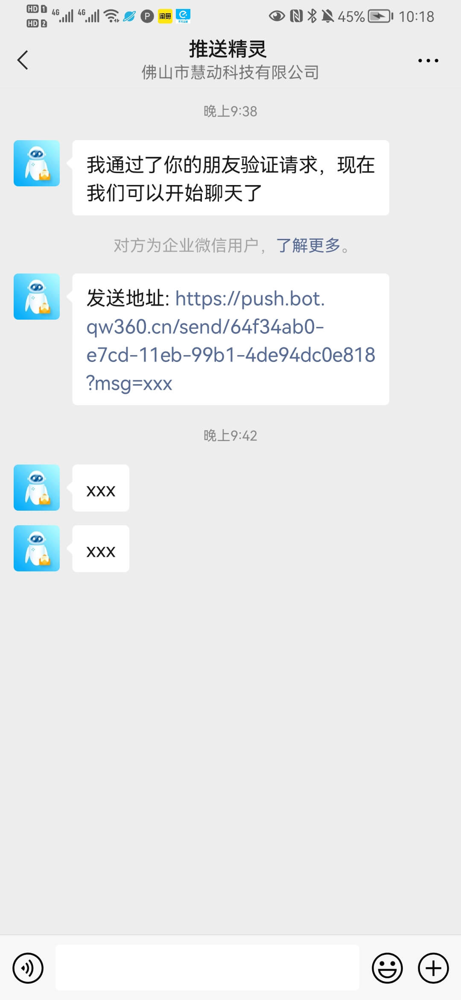

# push-bot
基于wechaty的微信推送机器人

关注机器人即可获得推送API地址

# 特点
* 代码精简，百行代码实现
* 基于Wechaty ，fastify
* 请求限制， 防止机器人账号被封，也避免消息骚扰
* 自动通过好友，自动发送地址

# 安装运行

1. 安装依赖 `npm install`

2. 配置参数，编辑WECHATY_TOEKN   `cp .env.example .env`

3. 运行 `node bot.js`

# 马上试用

请求api地址
