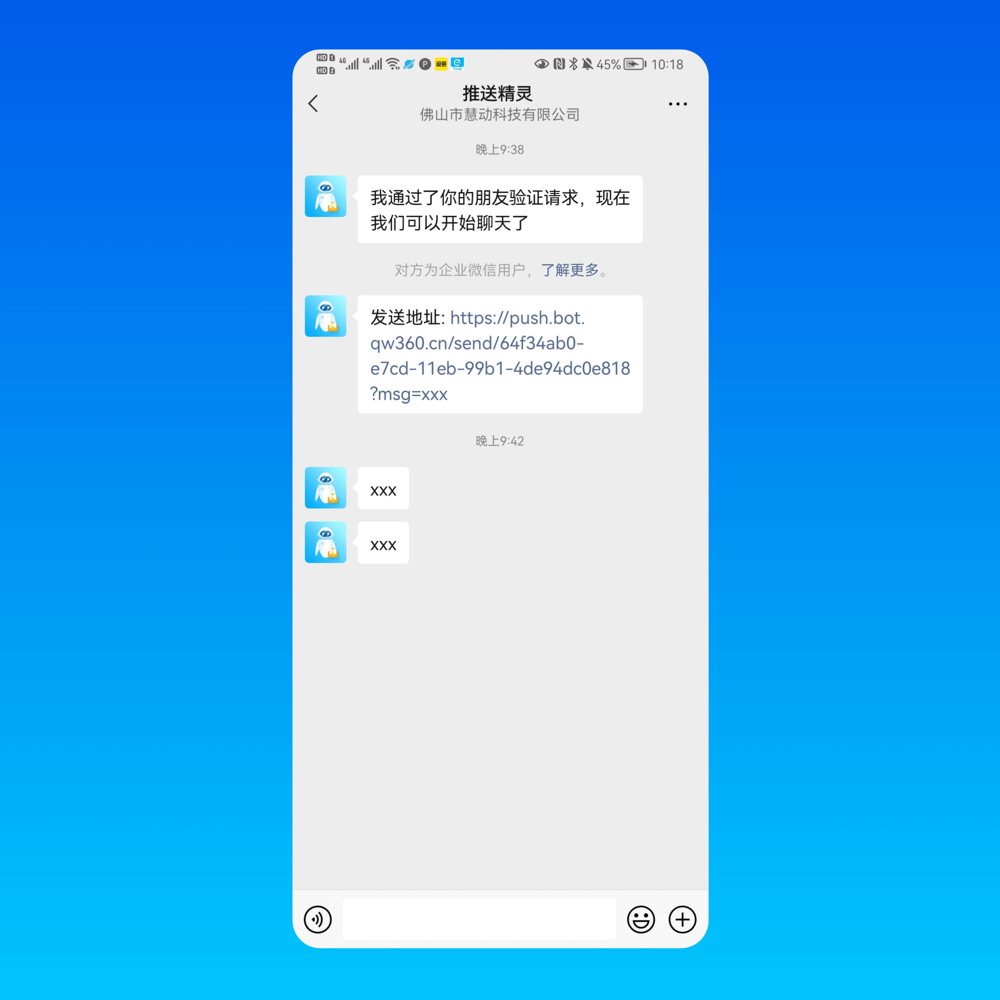

# push-bot

推送精灵 - 微信推送机器人

关注机器人即可获得推送 API 地址


## 特点
- 支持推送到个人微信和群
- 代码少，单文件实现
- 请求限制， 防止机器人账号被封，也避免消息骚扰
- 自动通过好友，自动生成接口地址

## 安装运行

1. 安装依赖 `npm install`

2. 配置参数，编辑 WECHATY_TOEKN `cp .env.example .env`

3. 运行 `node bot.js`

## 发送到个人接口

该接口通过关注机器人获得(主动私聊发送 `webhook` 或者 `推送地址` 可获得)


```
GET /send/:token?msg=xxx
```
```

POST /send/:token

{
    "msg": {
        "type": "image",
        "url": "https://example.com/1.png" // 图片 url 仅支持 https
    }
}

```


## 发送到群接口

邀请机器人入群即可获得推送接口地址


```

GET /room/:token?msg=xxx

```


## demo



### 更多

开发者微信 tianshe00
